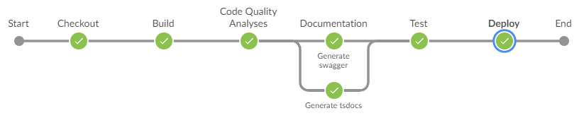

[](https://classroom.github.com/a/_RhJkP8O)


<p align="center">
 
</p>
<h1 align="center">DDDForum.com</h1>

<p align="center">
 <a href="https://circleci.com/gh/stemmlerjs/ddd-forum"></a>
 <a href="#contributors"></a>
</p>

> A [SOLID](https://khalilstemmler.com/articles/solid-principles/solid-typescript/) hackernews-inspired forum site built
> with TypeScript using
> the [clean architecture](https://khalilstemmler.com/articles/software-design-architecture/organizing-app-logic/)
> and [DDD best practices](https://khalilstemmler.com/articles/domain-driven-design-intro/).


## About

DDDForum.com is the application that we build
in [solidbook.io - The Software Design and Architecture Handbook](https://solidbook.io).

## Team's Project Technical Documentation

You may find a template for the project technical documentation in [docs/readme.md](docs/readme.md)
You should follow this examples as a template for your own work.

## Documentation

[Original Readme file](README-original.md)

[Readme file from dyarleniber](README-dyarleniber.md)

## Running the project

1. Install and start [Docker](https://docs.docker.com/compose/gettingstarted/) if you haven't already.
2. Copy the `.env` template file. Feel free to change passwords and app secrets.

```bash
cp .env.template .env
```

3. Build and run the image to run the backend services.

```bash
docker-compose up
```

4. Open up an additional console and then run:

```bash
npm run setup:dev
npm run start:both
```

You can visit the app by going to `http://localhost:3000`.

### Demo

[You can visit the site here](https://dddforum.com).

> `Note`: It's currently deployed on free tier Heroku, which has some undesirable side-effects like shutting off the
> server during periods of inactivity. So if it's down for you, refresh a couple of times. Thinking about migrating this
> to a serverless architecture later on.

## Technical Notes (ISEP)

### Tool Dependencies - Very Important!

This project requires the following tools to be present in your system.

**Use node version 12.22.12**

The use of this node version is mandatory
You an use **nvm** to manage several node version in your system (see https://github.com/nvm-sh/nvm)

**Python**
You may have to install **python v2.7** in your system (see https://www.python.org/)

### Using the API

Examples of using the API (without authentication, using postman)

- Get popular posts:
  GET http://localhost:5001/api/v1/posts/popular

- Get new posts:
  GET http://localhost:5001/api/v1/posts/recent

- Get post by slug:
  GET http://localhost:5001/api/v1/posts/?slug=9526372-gosto-muito-de-dd

- Get comments by slug:
  GET http://localhost:5001/api/v1/comments/?slug=9526372-gosto-muito-de-dd

- Login
  POST http://localhost:5001/api/v1/users/login
  body:
  {
  "username": "user",
  "password": "password"
  }
  return:
  {
  "accessToken": "...",
  "refreshToken": "..."
  }
  You can then use the "accessToken" for actions that require authentication, by passing the value of the accessToken in
  a header named "Authentication". For example:
- Get Me
  GET http://localhost:5001/api/v1/users/me
  Headers[
  ...
  Authorization: accessToken
  ]
  Response:
  {
  "user": {
  "username": "atb",
  "isEmailVerified": false,
  "isAdminUser": false,
  "isDeleted": false
  }
  }

### How to Admin da database

- open browser use localhost:8080
- use:
  - system: MySQL
  - server: mysql
  - username: tonysoprano
  - pass: 12345678
  - db name: data_dev

### How to Run Tests

To run tests type: npm run test

Existing unit tests:

- src/shared/core/Guard.spec.ts
- src/modules/forum/domain/postSlug.spec.ts
- src/modules/forum/domain/services/postService.spec.ts

The existing tests verify some services in the domain layer. The domain layer has no dependency on the other layers, so
there is no need for mocking. The tests can be executed without any dependencies (e.g., database, etc.)

### How to Debug

- start the services with *docker-compose up*
- To debug the backend in VSCode go to the tab "Run and Debug", select "Debug TypeScript in Node.js" from the dropdown
  list and click the play button (this will execute the configuration with the same nsame that is located in the
  launch.json file (*.vscode/launch.json*))
- start the front-end with *npm run start:public*
- open in browser: *localhost:3000*

### API Tests

These tests are not part of the base project. They were added by the team to test the API. The tests are in the folder
*src/api_test*.

The tests are based on the project https://github.com/jmfiola/jest-api-test-typescript-example. **The tests are executed
against the running docker containers as well as the backend**. These must be running. It is not necessary to execute
the frontend to run these tests. The tests are executed in sequence, so they are not independent. The tests are executed
in the order they are defined in the file (this is why we need to use the *--runInBand* jest option).

Before running API tests, you must "clear" all the existing data and run the containers and the backend. This will
ensure that the system is always at the same state when the tests area executed (i.e., an empty database). The command
that runs the API tests is *npm run test:api* and it already does all the necessary steps (see the command in
package.json).

**0. Add Test Report Support**

npm install jest-html-reporter@3.0.0 --save-dev

**1. Before Running Tests**

Start the containers:

    docker-compose up

Create the database:

    npm run db:create:dev
    npm run migrate:dev 

And also run the backend:

    npm run start:dev

**2. Running Tests**

**a)** To run only API tests (this will delete the database and recreate it, before running the tests; no need for step
3):

    npm run test:api

A report will be generated in report.html. Coverage report will be generated in coverage/index.html. *Note that coverage
report only covers code of the tests, it does not cover code of teh backend executed because we called the API.*

**b)** To run only unit tests:

    npm run test -- --testPathIgnorePatterns=api

**3. After Running Tests**

Stop the backend by hitting Ctrl+C in the terminal where the backend is running.

---

---

---

# REPORT GROUP 16

## 1. Branching model

**Git flow** is a Git branching model that involves the use of multiple branches with very specific roles assigned. On
the **Master** branch, each commit has a tag with a version number that represents an official release. The **Develop**
branch works as an integration branch for new features; it's important to note that new features should never interact
directly with **Master**. Whenever a new feature is to be created, a new **Feature** branch must be created from the *
*Develop** branch, and once it is finished it must be merged back to the **Develop** branch. When the **Develop** branch
has enough features for a release, a **Release** branch must be created where changes related to bug fixes,
documentation, and other release-oriented tasks should be committed. Once it's ready to ship, the **Release** branch
gets merged into master and tagged with a version number. **HotFix** branches as the name suggests are forked from the *
*Master** branch to quickly patch production releases. As soon as the fix is complete, it should be merged into both *
*Master** and **Develop**.


### 1.1. Branch naming

A git branch name should start with a category:

- **feature** (forked from **dev** → merged into **dev**)
- **bugfix** (forked from **dev** → merged into **dev**)
- **hotfix** (forked from **master** → merged into **master** and **dev**)
- **codequality** (forked from **dev** → merged into **dev**)
- **buildtools** (forked from **dev** → merged into **dev**)
- **pipeline** (forked from **dev** → merged into **dev**)
- **docs** (forked from **dev** → merged into **dev**)
- **report** (forked from **dev** → merged into **dev**)

... followed by the issue and a short description as shown in the example below:

**feature/#12/popular_posts_listing**

The next branches doesn't follow the chosen branch naming.

- **release** (forked from **dev** → merged into **master** and **dev**)
- **dev** (forked from **master** → merged into **master**)
- **master**

### 1.2. Keeping the branch history clean

Let's imagine the following scenario where the work from **feature** branch must be merged into **dev**.

**Note:** in the following images, `main` represents our `master` branch.


If the merge from **feature** into **dev** is not fast-forward, which means that there are conflicts, a new merge commit
will be created on the **dev** branch acting as a node to connect the two branches. Assuming that this can happen n
times through the development, the **dev** branch history can become a little "messy". The next image shows a three-way
merge from branch **feature** into branch **dev**. The merge commit is shown in blue.


Avoiding three-way merges can be done with the help of git rebase. When rebasing branch **dev** into **feature** means
that we want to shift the beginning of the **feature** branch to the tip of the **dev** branch. With this, we are
rewriting the history of our **feature** branch. This must be only performed on a non-shared branch.
When doing this, we are forcing the fast-forward merge.

`git checkout feature`

`git rebase dev`

(Solve conflicts)

`git add .`

`git rebase --continue`

The last commands output a result, as shown in the next image.


After performing a `git merge feature` (assuming that the current checked out branch is **dev**), merging
**feature** into **dev** will result on a fast-forward merge as shown on the next figure.


### 1.3. Commits messages rules

The commits messages must start with #<issue_number> followed by a specific and understandable message for what the
commit
has and what was the work done in it. For example:

**#12 Feature - Listing popular posts complete**

## 2. Maturity Model classification

| Aspect                        | Level | Details                                                                                                                                                                                                  |
|-------------------------------|-------|----------------------------------------------------------------------------------------------------------------------------------------------------------------------------------------------------------|
| Build Management and CI       | 0     | We utilize a pipeline that triggers builds and conducts tests. The ability to manually initiate a trigger enables us to force the rebuilding of a specific build. Our artifacts are stored on DockerHub. |
| Environments and deployment   | 0     | Our pipeline incorporates a deployment stage that autonomously deploys the application in a cost-effective manner and application versions are stored in dockerhub                                       |
| Release management Compliance | 0     | It's challenging to track requirements for releases, and there is limited automation in the release process.                                                                                             |
| Testing                       | 0     | Tests run autonomously in the pipeline, allowing developers to check if they passed or not.                                                                                                              |
| Data management               | 0     | Migrations are executed by triggering the pipeline using Flyway, making them automated script executions.                                                                                                |
| Configuration management      | 0     | We use Git as version control where everything is stored.                                                                                                                                                

## 3. Pipeline build history

In this section it will show the build pipeline progress throw the time.

### 3.1. 'Initial' pipeline build

Bellow is the first pipeline build.


As we can see in the picture, the first pipeline was like a starting point, with the stages as small as possible, and
the deployment, at this stage, wasn't doing anything other than simply making a print on the console.

In the beginning, the checkout strategy was carried out via a specific branch, as we can see in the code below.

```groovy
stage('Checkout') {
  steps {
    echo "Checking out.."
    checkout scmGit(
            branches: [[name: '*/dev']],
            extensions: [],
            userRemoteConfigs: [
                    [credentialsId: "odsoft_ssh_key",
                     url          : 'git@github.com:Departamento-de-Engenharia-Informatica/2023-2024-odsoft-project-assignment-2023-2024-mei-odsoft-g016.git']
            ])
  }
}
```

For this strategy, all the elements that needed to execute a pipeline had to create a credential in Jenkins
called `odsoft_ssh_key`. The pipeline was manually triggered and specifically targeted a single branch. As part of the
process, it was essential to rename the pipeline according to the case requirements. At this stage, there were no
parallelization implemented in the pipeline.

### 3.2. 'Middle' pipeline build

Bellow is the 'middle' pipeline build.



At this stage of the pipeline, some valuable stages have been introduced, focusing on code analysis and documentation
generation. There is also an initial consideration for performance when parallelize tasks, as seen in the
documentation generation process with the Swagger and TSDoc.

While the checkout process is still manual and directed to a specific branch, like the previous one, there is some
progress, as deployment tasks now include a copy/replace operation.

### 3.3. 'Final' pipeline build

Bellow is the first pipeline build.


In this evolved pipeline, the incorporation of parallel activities is evident, contributing to enhanced performance. Key
tasks within the primary activities include static code checking, integration testing, documentation generation, and a
blue/green pattern deployment.

Notably, the checkout process has been refined, moving away from a focused branch
approach. Instead, it now utilizes a trigger and webhooks strategy.
The detailed explanation of this strategy is provided throughout the document.
In essence, for each activity in the repository, a pipeline is triggered, and
conditional logic determines which steps to execute based on the context, or even ignores
the all execution of the pipeline.

## 4. Code Quality and Integration Tests (Concern 2.3)

> Author: 1230211@isep.ipp.pt (Rui Jorge Machado Neto)

### 4.1. Pipeline concern design


### 4.2. Code quality

Code quality is a crucial aspect of software development that directly impacts the reliability, maintainability, and
overall success of a project. It refers to the degree to which a codebase adheres to best practices, standards, and is
free from defects or errors.

To ensure and maintain code quality, we established and enforced code quality thresholds. These thresholds are
predefined criteria or standards that code must meet to be considered acceptable. Setting and enforcing these thresholds
helped maintain a healthy codebase by catching issues early.

To complete this process, the chosen tool was **ESLint**.
The following dependencies were included in ```package.json```.

```json
"@typescript-eslint/eslint-plugin": "^5.0.0",
"@typescript-eslint/parser": "^5.0.0",
"eslint": "^6.1.0",
"eslint-detailed-reporter": "^0.9.0",
"eslint-plugin-react": "^7.33.2"
```

**ESLint** is a static code analysis tool that helps identify and fix problems in JavaScript and TypeScript code. It
provides configurable rules to enforce coding standards.

Its integration into our development workflow helped create a proactive approach to code quality, aligning with best
practices.

#### 4.2.1. Code quality rules

The following code is located in file ```.eslintrc.json``` inside root directory. This file is responsible for defining
the set of rules needed for the code to be healthy.

```json
{
  "env": {
    "browser": true
  },
  "parser": "@typescript-eslint/parser",
  "parserOptions": {
    "ecmaFeatures": {
      "jsx": true
    },
    "ecmaVersion": 12
  },
  "plugins": [
    "react",
    "@typescript-eslint"
  ],
  "rules": {
    "capitalized-comments": [
      "error",
      "always",
      {
        "ignoreConsecutiveComments": true
      }
    ],
    "eqeqeq": [
      "error",
      "smart"
    ],
    "max-classes-per-file": [
      "error",
      10
    ],
    "getter-return": "error",
    "for-direction": "error",
    "no-duplicate-imports": "error",
    "no-self-compare": "error",
    "no-empty": "error"
  }
}
```

#### 4.2.1.1. capitalized-comments

Comments are useful for leaving information for future developers. In order for that information to be useful and not
distracting, it is sometimes desirable for comments to follow a particular style. Many developers would agree that a
consistent style can improve a project’s maintainability.

This rule aims to enforce a consistent style of comments across the codebase, specifically by requiring a capitalized
letter as the first word character in a comment. This rule will not issue warnings when non-cased letters are used.

This rule is set to require a non-lowercase letter at the beginning of comments.

**ignoreConsecutiveComments:** the rule will not report on a comment which violates the rule, as long as the comment
immediately follows another comment.

#### 4.2.1.2. eqeqeq

It is considered good practice to use the type-safe equality operators === and !== instead of their regular
counterparts == and !=. The reason for this is that == and != do type coercion which follows the rather obscure Abstract
Equality Comparison Algorithm.

If one of those occurs in an innocent-looking statement such as a == b the actual problem is very difficult to spot.

This rule is aimed at eliminating the type-unsafe equality operators.

**smart** option enforces the use of === and !== except for these cases:

* Comparing two literal values;
* Evaluating the value of typeof;
* Comparing against null.

#### 4.2.1.3. max-classes-per-file

Files containing multiple classes can often result in a less navigable and poorly structured codebase. Best practice is
to keep each file limited to a single responsibility.

This rule enforces that each file may contain only a particular number of classes and no more.

#### 4.2.1.4. getter-return

The get syntax binds an object property to a function that will be called when that property is looked up.

This rule enforces that a return statement is present in property getters.

#### 4.2.1.5. for-direction

Enforce "for" loop update clause moving the counter in the right direction

A for loop with a stop condition that can never be reached, such as one with a counter that moves in the wrong
direction, will run infinitely. While there are occasions when an infinite loop is intended, the convention is to
construct such loops as while loops. More typically, an infinite for loop is a bug.

This rule forbids for loops where the counter variable changes in such a way that the stop condition will never be met.
For example, if the counter variable is increasing (i.e. i++) and the stop condition tests that the counter is greater
than zero (i >= 0) then the loop will never exit.

#### 4.2.1.6. no-duplicate-imports

Using a single import statement per module will make the code clearer because we can see everything being imported from
that module on one line.

This rule requires that all imports from a single module that can be merged exist in a single import statement.

#### 4.2.1.7. no-self-compare

Comparing a variable against itself is usually an error, either a typo or refactoring error. It is confusing and may
potentially introduce a runtime error.

The only time you would compare a variable against itself is when you are testing for NaN. However, it is far more
appropriate to use typeof x === 'number' && isNaN(x) or the Number.isNaN function for that use case rather than leaving
the reader of the code to determine the intent of self comparison.

This error is raised to highlight a potentially confusing and potentially pointless piece of code. There are almost no
situations in which we would need to compare something to itself.

#### 4.2.1.8. no-empty

Empty block statements, while not technically errors, usually occur due to refactoring that was not completed. They can
cause confusion when reading code.

This rule disallows empty block statements. This rule ignores block statements which contain a comment (for example, in
an empty catch or finally block of a try statement to indicate that execution should continue regardless of errors).

#### 4.2.2. Applying ESLint tool

To use the ESLint tool, we created a script inside ```package.json``` called ```check:code```. This script is responsible
for generate an HTML report inside the directory ```./code_quality_artifacts```.

```json
"check:code": "eslint dist -f node_modules/eslint-detailed-reporter/lib/detailed.js -o code_quality_artifacts/eslint_report.html"
```

#### 4.2.3. Code quality stage addition to pipeline

Now, to check the code quality in the pipeline, we just added the script created before to
the  ```stage('Code Quality Analysis')```.

* If the code matches the rules defined, it means that it's healthy so the pipeline proceeds and the report is
  published.
* If the code is not healthy, the pipeline fails and the report is also published, so the developer can see why it
  failed and solve the problems.

```pipeline
stage('Code Quality Analysis') {
    steps {
        echo 'Checking Code Quality...'
        execute_command('npm run check:code')
    }
    post {
        success {
            publish_html('code_quality_artifacts/', 'eslint_report.html', 'Code Quality Report')
            echo 'Code Quality Analyses succeeded!'
        }
        failure {
            publish_html('code_quality_artifacts/', 'eslint_report.html', 'Code Quality Report')
            echo 'Code Quality Analyses failed!'
        }
    }
}
```

**HTML publish:**

In the code snipet above, it's possible to see a function called ```publish_html``` being called. This function is
responsible for publishing the all over the pipeline generated HTML reports on jenkins. The function is shown next.

```pipeline
def publish_html(String reportDir, String reportFiles, String reportName) {
    publishHTML(target: [allowMissing         : false,
                         alwaysLinkToLastBuild: true,
                         keepAll              : false,
                         reportDir            : reportDir,
                         reportFiles          : reportFiles,
                         reportName           : reportName])
}
```

This function receives 3 Strings: reportDir, reportFiles and reportName - all the 3 are used in
the [publishHTML](https://www.jenkins.io/doc/pipeline/steps/htmlpublisher/) plugin function.  
The publishHTML uses a Nested Object that has the following values:

- **allowMissing**: If checked, will allow report to be missing and build will not fail on missing report;
- **alwaysLinkToLastBuild**: If this control and "Keep past HTML reports" are checked, publish the link on project level
  even if build failed;
- **keepAll**: If checked, archive reports for all successful builds, otherwise only the most recent;
- **reportDir**: The path to the HTML report directory relative to the workspace;
- **reportFiles**: The file(s) to provide links inside the report directory;
- **reportName**: The name of the report to display for the build/project, such as "Code Coverage".

#### 4.2.4. Code quality analysis - Before vs After

Before the refactor, the code exhibited a lack of adherence to any defined coding standards. However, following the
implementation of ESLint, a remarkable transformation took place.

As soon as the rules were defined, the report found several errors that were later revised. The result of this first
report is shown below.

*Before*


Once the code has been refactored, it's possible to see the evolution and the absence of inconsistencies throughout the
code.

*After*


#### 4.2.5. Alternative to ESLint - Prettier

**Prettier** is a code formatter that automatically analyzes and restructures code to adhere to a consistent style, thus
eliminating debates over code formatting. It supports a multitude of programming languages, making it a versatile
solution for maintaining a uniform coding style across different file types. Why was ESLint the choice?

*Key Distinctions between ESLint and Prettier*

Scope:

- ESLint: Primarily a linter that identifies and fixes issues related to code quality, style, and potential bugs. It
  provides a wide range of configurable rules to enforce coding standards.
- Prettier: Focused exclusively on code formatting, Prettier doesn't concern itself with identifying coding errors or
  enforcing specific coding conventions beyond formatting.

Configurability:

- ESLint: Highly customizable through its configuration files, ESLint allows to define and adjust rules according to our
  project's specific requirements.
- Prettier: Follows an opinionated approach, minimizing configuration to provide a straightforward and consistent code
  formatting experience. While it offers some configuration options, they are intentionally limited to maintain ease of
  use.

*Integration with ESLint:*

It's worth noting that ESLint and Prettier are often used together to complement each other. ESLint handles static
analysis and identifies potential issues, while Prettier ensures a consistent and aesthetically pleasing code format.

### 4.3. Integration Tests

Integration testing is a crucial phase in the software development lifecycle that aims to validate the interactions and
interfaces between different components of a system. In this case, the main goal of our integration tests was to verify
the accuracy of the API (Application Programming Interface).

#### 4.3.1. Integration Tests Thresholds

To complete this process, the chosen tool was **Jest**.
The following dependencies were already included in ```package.json```.

```json
"dependencies": {
"@types/jest": "^24.0.18",
"jest": "^24.9.0",
"ts-jest": "^24.1.0"
}
"devDependencies": {
"jest-html-reporter": "^3.0.0",
"jest-html-reporters": "^3.1.5"
}
```

**Jest** is a delightful JavaScript Testing [Framework](https://jestjs.io/) with a focus on simplicity. It works with
projects using: Babel, TypeScript, Node, React, Angular, Vue and more.

The following code is located in file ```jest_integration.config.js``` inside root directory. This file contains the
whole configuration of the integration tests, including the thresholds that define if the integration tests results are
healthy or not.

```js
module.exports = {
  "transform": {
    "^.+\\.ts?$": "ts-jest"
  },
  "testEnvironment": "node",
  "testRegex": "./src/.*\\.(test|spec)?\\.(ts|ts)$",
  "moduleFileExtensions": [
    "ts",
    "tsx",
    "js",
    "jsx",
    "json",
    "node"
  ],
  "roots": [
    "<rootDir>/src"
  ],
  "reporters": [
    "default",
    [
      "./node_modules/jest-html-reporter",
      {
        "outputPath": "./integration_tests_artifacts/test_report.html"
      }
    ]
  ],
  "coverageReporters": [
    "text",
    "json",
    "html"
  ],
  "coverageThreshold": {
    "global": {
      "branches": 50,
      "functions": 80,
      "statements": 80,
      "lines": 80
    }
  }
};
```

- **Branch coverage**: has each branch (also called DD-path) of each control structure (such as in if and case
  statements) been executed? For example, given an if statement, have both the true and false branches been executed?
  Another way of saying this is, has every edge in the program been executed?
- **Function coverage**: has each function (or subroutine) in the program been called?
- **Statement coverage**: has each statement in the program been executed?
- **Line coverage**: has each executable line in the source file been executed?

The values chose looked realistic and achievable. When defining this type of threshold, it's important to keep in mind
that, better than coverage all the code, is to focus on covering critical paths and functionalities. While aiming for a
high overall code coverage percentage is a positive goal, it's equally crucial to prioritize testing the new developed
features.

#### 4.3.2. Applying Jest tool

To use the Jest tool for integration testing, we created a script inside ```package.json``` called ```test:api```. This
script is responsible
for test and generate the HTML reports inside the directory ```./integration_tests_artifacts```.

```json
    "test:api": "npm run db:delete:dev && npm run db:create:dev && npm run migrate:dev && jest --coverage --config=\"jest_integration.config.js\" --coverageDirectory=\"./integration_tests_artifacts/coverage\" --testPathPattern=\"/api\" --coverageReporters=\"text\" --coverageReporters=\"html\" --coverageReporters=\"json\""
```

#### 4.3.3. Integration Tests addition to pipeline

Now, to run the integration tests in the pipeline, we added the script created before to
the  ```stage('Integration Tests')```.

```pipeline
stage('Integration Tests') {
    when {
        expression { branch != "null" && rollback.action != "rollback" }
    }
    steps {
        echo 'Running Integration tests...'
        execute_command('docker compose -f docker-compose-integration.yml up -d')
        execute_command("docker build . -t simaosantos1230212/ddd_forum:$BUILD --no-cache")
        execute_command("docker run -d --name ddd_forum_app --network ddd_forum_network_integration simaosantos1230212/ddd_forum:$BUILD")
        sleep time: 30, unit: 'SECONDS'
        execute_command('docker exec -i ddd_forum_app npm run test:api')
    }
    post {
        success {
            execute_command("""
            docker cp "ddd_forum_app:/usr/src/ddd/integration_tests_artifacts" .
            """)
            publish_html('integration_tests_artifacts/', 'test_report.html', 'Integration Tests Report')
            publish_html('integration_tests_artifacts/coverage', 'index.html', 'Integration Tests Coverage Report')
            stop_and_remove_container("ddd_forum_app")
            execute_command('docker compose -f docker-compose-integration.yml down')
            echo 'Integration tests succeeded!'
        }
        failure {
            execute_command("""
            docker cp "ddd_forum_app:/usr/src/ddd/integration_tests_artifacts" .
            """)
            publish_html('integration_tests_artifacts/', 'test_report.html', 'Integration Tests Report')
            publish_html('integration_tests_artifacts/coverage', 'index.html', 'Integration Tests Coverage Report')
            stop_and_remove_container("ddd_forum_app")
            execute_command('docker compose -f docker-compose-integration.yml down')
            echo 'Integration tests failed!'
        }
    }
}
```

#### 4.3.3.1. Decomposition of this stage

> execute_command('docker compose -f docker-compose-integration.yml up -d')

This command is responsible for run the docker compose located in ```docker-compose-integration.yml```. This file
creates 2 containers - one with a mysql image, and the other with a redis image.

> execute_command("docker build . -t simaosantos1230212/ddd_forum:$BUILD --no-cache")

This command is responsible to build the application docker image.

> execute_command("docker run -d --name ddd_forum_app --network ddd_forum_network_integration
> simaosantos1230212/ddd_forum:$BUILD")

After the image is built, we use this command to run the image inside ```ddd_forum_network_integration``` network.

> sleep time: 30, unit: 'SECONDS'

Here, we set a 30 seconds sleep for the application to start (based on the average).

> execute_command('docker exec -i ddd_forum_app npm run test:api')

Finally, we run the tests inside the container.

```success {```

- If the tests **succeed**, we copy the artifacts from the container, publish them, destroy all the containers used to
  run the integration tests, and the pipeline continues.

```failure {```

- If the tests **fail**, we copy the artifacts from the container, publish them, destroy all the containers used to run
  the integration tests, and the pipeline fails.

#### 4.3.4. Integration Tests - Before vs After

The integration tests landscape was characterized by a limited scope, encompassing essential scenarios within the
software application. The suite was relatively smaller, focusing primarily on just create a user and get posts. As a
result, the overall assurance of the system's interoperability and robustness in complex scenarios might have been
incomplete.

*Before*


*Before - Coverage*


With the upgrade, the integration tests underwent a substantial transformation. The testing suite expanded
comprehensively to cover a broader range of scenarios, including the new developed features (tags). The update reult is
shown below.

*After*


*After - Coverage*


*Integration tests added:*

- [X] create tag
- [X] create repeated tag
- [X] create post
- [X] get popular posts
- [X] add tag to post
- [X] how many tags does a user has
- [X] how many tags does a post has

#### 4.3.5. Alternative to Jest - Mocha

**Mocha** is a feature-rich JavaScript test framework running on Node.js and in the browser,
making asynchronous testing "simple and fun". Mocha tests run serially, allowing for flexible and
accurate reporting, while mapping uncaught exceptions to the correct test cases.

### 4.4. Stryker Mutator

Mutation testing is a software testing method that gauges the effectiveness of a test suite by introducing artificial
changes, or mutations, into the source code. The aim is to assess whether the tests can identify and locate these
mutations, revealing potential weaknesses in the testing strategy.

One widely used tool for mutation testing in TypeScript is [Stryker Mutator](https://stryker-mutator.io/docs/), an
open-source framework that automates the process of injecting mutations into the codebase, running tests, and analyzing
the results.

To run this tests, we installed the stryker mutator dependencies and, after a long search, we find out that this tester
needs at least version 3.7 of typescript. Next, we show the dependencies installed.

```json
"dependencies": {
"typescript": "^3.7.6"
}

"devDependencies": {
"@stryker-mutator/core": "^5.6.1",
"@stryker-mutator/jest-runner": "^5.6.1"
}
```

After the installation, a file called ```stryker.conf.json``` was created containing the configuration for the tests to
run. The configuration is represented next.

```json
{
  "$schema": "./node_modules/@stryker-mutator/core/schema/stryker-schema.json",
  "packageManager": "npm",
  "reporters": [
    "html",
    "clear-text",
    "progress"
  ],
  "testRunner": "jest",
  "coverageAnalysis": "off",
  "tsconfigFile": "./tsconfig.json",
  "mutate": [
    "src/**/*.ts",
    "!src/**/*.spec.ts"
  ],
  "jest": {
    "projectType": "custom",
    "configFile": "./jest_integration.config.js",
    "config": {
      "testEnvironment": "jest-environment-jsdom",
      "preset": "ts-jest",
      "resetModules": true
    },
    "enableFindRelatedTests": true
  },
  "disableTypeChecks": "src/**/*.ts",
  "timeoutMS": 60000
}
```

Finally, we ran the ```stryker run``` command for the tests to be executed. The following HTML
is generated inside ```reports/mutation/html/index.html```.


- **Mutation Score**: This represents the overall effectiveness of our test suite in detecting mutations. It is given as
  a percentage. In the "api_test" section, for example, the mutation score is 95.30%, indicating that 95.30% of
  mutations were detected by the test suite.

- **Killed**: The number of mutants that were killed by our test suite. Mutants are variations of our code with
  intentional faults.

- **Survived**: The number of mutants that survived, meaning the corresponding test cases did not catch the introduced
  faults.

- **Timeout**: The number of mutants that caused a test timeout. A timeout occurs when a test takes too long to execute.

- **No Coverage**: Mutants for which there is no test coverage. This indicates areas of our code that are not covered by
  our tests.

- **Ignored**: Mutants that were intentionally ignored during the testing process.

- **Runtime Errors**: The number of mutants that resulted in runtime errors during testing.

- **Compile Errors**: The number of mutants that led to compilation errors.

- **Total Detected**: The total number of mutants detected by our test suite (sum of Killed, Timeout, No Coverage, and
  Ignored).

- **Total Undetected**: The total number of mutants not detected by our test suite (sum of Survived, Runtime Errors, and
  Compile Errors).

- **Total Mutants**: The overall number of mutants generated during the mutation testing process (sum of Total Detected
  and Total Undetected).

Unfortunately, after changing the typescript version, other application problems started to appear... This
situation took us a while to resolve, ending in an uncompleted goal reach... However, to make this work
in the pipeline, we just needed to add the command ```stryker run``` and publish the artifacts generated using the
previous talked about function.

## 5. Documentation and Database (Concern 2.2)

> Author: 1230201@isep.ipp.pt (Nuno Dinis Gonçalves Ribeiro)

### 5.1. Pipeline design


For this step, it involves the generation of documentation, the creation of a PDF, and the preparation of a submission
ZIP file. This sequence was chosen to prioritize code generation initially. The subsequent steps involve generating
other files, with each step depending on the completion of the previous one.

In this process, it would be beneficial to implement a mechanism for tracking documentation changes. This would help
avoid unnecessary and repetitive regeneration of documentation, optimizing the workflow, but that was not implemented.

### 5.2. Swagger documentation

API documentation is essential to ensure that anyone utilizing the API has access to fundamental information. This
empowers frontend teams, and others backend teams to operate independently of the API development team. In this case is
essential to produce it on the process of CI/CD to guarantee that the project walks together with updated documentation
in the workspace of pipeline and in the artifacts.

#### 5.2.1. Tool chosen

After reviewing different tools, the final decision came down to choosing between [Swagger](https://swagger.io/)
and [API Extractor](https://api-extractor.com/).

Swagger was chosen over API Extractor, because has a larger and more popular community, making it more widely adopted
compared to the smaller and niche following of API Extractor. The user interface of Swagger is also more recognized and
familiar among developers, providing ease of understanding. In contrast, API Extractor tends to focus on a more
descriptive and textual presentation using markdown, which might not be as intuitive for some.

Another practical aspect favoring Swagger is its use of the [OpenAPI specification](https://swagger.io/specification/).
This allows the generation of a JSON file that can be easily used in various tools for visualizing the API documentation
and automating create requests in order to test these endpoints. This interoperability with different tools adds to the
convenience and practicality of using Swagger.

Exists more options, for instance, [Stoplight](https://stoplight.io/demo), that take a generic web approach to API
documentation. They enable the import of an OpenAPI specification or the creation of one through an editor, and with
that create a UI that makes it possible to visualize the API documentation and allow the execution of requests. However,
it's important to note that they are focused on the visualization, so exists an absence of SDKs for code generation, so
doesn't fit in this case.

#### 5.2.2. Introduction

The goal is to generate comprehensive documentation for both schemas and endpoints using the standard OpenAPI
specification. On the models, we provide detailed information about the schemas, adhering to OpenAPI standards. On the
other hand, in the endpoints, we incorporate comment specifications to the REST request.

> For the swagger purpose it was documented the schemas and the endpoints related to the User aggregate and of the new
> functionalities developed.

#### 5.2.3. Dependencies

In order to fulfill the task, the following dependencies have been added to the project.

```json
"swagger-jsdoc": "^6.2.8",
"swagger-ui-express": "^5.0.0",
```

This two dependencies work together, given that the [swagger-jsdoc](https://www.npmjs.com/package/swagger-jsdoc) is used
to generate a JSON file representing the OpenAPI specification by converting the comments code in the existing code,
creating the definitions of endpoints and schemas. In the other hand,
the [swagger-ui-express](https://www.npmjs.com/package/swagger-ui-express) leverages this JSON file to generate and
expose the UI.

#### 5.2.4. Swagger object

It's fundamental to write a [Swagger object](https://swagger.io/specification/v2/#swagger-object) that will describe the
definition of the documentation where has the name of `swagger-config.json`, and the important aspects of the document
are described in the following:

- **Info**: This section encapsulates essential details such as the application title and version for informational
  purposes.

- **Security**: Given that the application relies on JWT for security, is necessary to create a schema
  of [bearerAuth](https://swagger.io/docs/specification/authentication/bearer-authentication/?sbsearch=bearerAuth), to
  permit the action of adding a JWT token on the requests, giving that the app uses this type of authentication.

- **Schemas**: Describes the DTOs used in the various transactions.

- **Servers**: It is also important to describe the servers where the API refers to be doing the requests. In this case
  it will be the production server, since the other environment, like integration test environment, is not justifiable
  to mention in here.

> Note: Exists a field called **Apis**, which is a variable that holds a significant importance as it describes the
> paths to search for the OpenAPI comments specifications in the project. However, it's not a standard value in the
> configuration file. Therefore, it's essential to include it separately in both the npm task and the API logic, as it
> will be possible to see.

The code snippet bellow represents the configuration field
described before.

```json
{
  "openapi": "3.0.0",
  "info": {
    "title": "ODSOFT - DDD Forum",
    "version": "1.0.0",
    "description": "This is the API documentation"
  },
  "components": {
    "securitySchemes": {
      "bearerAuth": {
        "type": "apiKey",
        "in": "header",
        "name": "Authorization",
        "description": "Token without Bearer prefix"
      }
    },
    "schemas": {
      ...
    }
  },
  "security": [
    {
      "bearerAuth": []
    }
  ]
}
```

#### 5.2.5. OpenAPI comments specification

In the provided code snippet, it's possible to observe a detailed specification for a Data Transfer Object (DTO). This
specification outlines the schema of the DTO, highlighting the variables of the model along with their corresponding
descriptions. Notably, Swagger has the supports of the primitive based on JSON-Schema Draft 4, as supported in
the [swagger documentation]("https://swagger.io/specification/v2/?sbsearch=Types"). It's possible to associate complex
objects by referencing the schema's identifier. For instance, if a schema requires the use of the UserDTO, it's
necessary to reference it using $ref: '#/components/schemas/UserDTO', as it will be possible to see in the endpoints
descriptions.

```ts
/**
 * @openapi
 * components:
 *   schemas:
 *     UserDTO:
 *       type: object
 *       required:
 *         - username
 *       properties:
 *         username:
 *           type: string
 *           description: The username of the user.
 *         isEmailVerified:
 *           type: boolean
 *           description: Indicates whether the user's email is verified.
 *         isAdminUser:
 *           type: boolean
 *           description: Indicates the user is an admin user.
 *         isDeleted:
 *           type: boolean
 *           description: Indicates the user is deleted.
 */
export interface UserDTO {
  username: string;
  isEmailVerified?: boolean;
  isAdminUser?: boolean;
  isDeleted?: boolean;
}
```

For endpoints, we can describe tags, which are responsible for grouping related operations within a specific scope.
Analyzing the code snippet, it's possible to verify that the summary and description are used to give more detailed
information. The requestBody section specifies the expected data format, referencing the UserCreateDTO. The responses
section details potential outcomes, providing descriptions and referring to abstracted schemas such as
BasicMessageResponse. The approach of having a standard error message response is supported on the rationale that all
error responses share a common structure object with a 'message' string parameter. To avoid redundancy, this structure
is abstracted into a single schema called BasicMessageResponse.

```ts
/**
 * @openapi
 * /api/v1/users:
 *   post:
 *     tags:
 *       - Users
 *     summary: Register a new user
 *     description: Endpoint to register a new user.
 *     requestBody:
 *       content:
 *         application/json:
 *           schema:
 *             $ref: '#/components/schemas/UserCreateDTO'
 *     responses:
 *       200:
 *         description: Successful response.
 *       409:
 *         description: Conflict
 *         content:
 *           application/json:
 *             schema:
 *               $ref: '#/components/schemas/BasicMessageResponse'
 *       500:
 *         description: Internal Server Error.
 *         content:
 *            application/json:
 *              schema:
 *                $ref: '#/components/schemas/BasicMessageResponse'
 */
userRouter.post('/',
        (req, res) => createUserController.execute(req, res)
);
```

#### 5.2.6. Practical rational of generation of swagger docs

**Generation of output file**

The objective is to expose the Swagger docs through the existing API, so that clients can access the docs, it will be
exposed on `"http(s)://.../swagger-docs"`. Also, it will be generated the OpenAPI specification output to a JSON file
for archiving purposes, so this can be "converted", in the future, to a documentation UI using, for example, some tools
similar to [Stoplight](https://stoplight.io/demo), as it was cited before.

In both situations is necessary the use of the swagger configuration file, and for that reason it was created a literal
JSON file called `swagger_config.json`, as it was shown before, that serves both purposes and avoid redundancy, because
in another way we would need to use a object inside the app and another, like it was done in the first place, but after
a refactor now it's more maintainable having a single point of change.

However, exists a minor difference between both, because we need to say the servers where the swagger must do the
request. When exposing in the app we can simply say that the server it will be the same as is hosted, like is being
done, but on the JSON is necessary to explicit set the array `server []` in the output JSON.

The tasks that generates the swagger JSON output was created on the `package.json`, and are describes bellow:

```json
    "docs:swagger": "npx swagger-jsdoc -d swagger_config.json ./src/**/**.ts -o ./swagger_output.json && ts-node buildtools_scripts/add_servers_to_swagger.ts",
```

Where uses the `npx swagger-jsdoc` to generate the output files taking in consideration the swagger configuration
mention before, after that, the files to be searched and what is the output file with the tag -o. After that, it's
executed the `add_servers_to_swagger.ts` script that will read the generated file, add the servers parameter, write to a
new folder called `swagger_docs`, and deletes the older one, in order to resolve the problem cited before of not having
the server specified.

Bellow is part of the script `add_servers_to_swagger.ts`.

```ts
//Read the swagger output
fs.readFile(jsonReadFilePath, 'utf8', (err, data) => {
  if (err) {
    console.error(`Error in adding the server to swagger output json ${jsonReadFilePath}: ${err}`);
    return;
  }

  try {
    //Parse and updates the json file
    const jsonData = JSON.parse(data);
    const servers = {
      url: process.env.DDD_SWAGGER_SERVER_PROD_URL,
      description: process.env.DDD_SWAGGER_SERVER_PROD_DESCRIPTION,
    };
    jsonData.servers = [servers];
    const updatedJsonData = JSON.stringify(jsonData, null, 2);
  ...
  }
```

**Exposition through endpoint**

On the other hand, to expose the documentation live, is necessary to read the swagger configuration file, adds the
folder to be searched for OpenAPI specifications, and to expose a endpoint.

```ts
//Read from the json file
const swaggerOptions = JSON.parse(readFileSync('./swagger_config.json', 'utf-8'));

//Adds the file sources to be searched
const swaggerOptionsFinal: swaggerJson.Options = {
  definition: swaggerOptions,
  apis: [
    './src/**/**.ts',
    './src/modules/users/infra/http/routes/index.ts',
  ]
}

v1Router.use('/swagger-docs', swaggerUi.serve, swaggerUi.setup(swaggerSpecs));
```

#### 5.2.7. Pipeline

The Swagger task is set to run following the successful execution of code quality analysis, unit tests, and integration
tests. This decision is based on the rationale that we aim to document only fully functional and operational versions.
Concurrently, it will run alongside the TSDocs task, both positioned at the same level, allowing for potential time
optimization. The resulting artifacts are archived and published on Jenkins for future API UI exposure.

In the code bellow is possible to see the stage, where it calls the script located on the package.json and after that
archives the output. This stage runs in parallel with the TSDoc generation.

```groovy
stage('Documentation') {
  when {
    expression { branch != "null" }
  }
  parallel {
    stage('Generate tsdocs') {
      ...
    }
    stage('Generate swagger') {
      steps {
        echo 'Generating swagger...'
        bat 'npm run docs:swagger'

        echo 'Archiving swagger...'
        archiveArtifacts 'swagger_docs/**'
      }
    }
  }
}
```

### 5.3. TSDoc documentation

TSDoc is a way of standardizing TypeScript documentation, so that all documentation-generating tools have a standard and
there is uniformity between tools.

TSDoc alone doesn't generate output like HTML UIs, or markdown reports, because a parser is needed. The parser will
interpret the comments in TSDoc format, and will transform them to the documentation itself.

There are some options, and for this case it was analyzed the [TypeDoc]("https://github.com/TypeStrong/typedoc") and,
once again, the API Extractor. Both tools have the ability to parse TSDoc into documentation itself, with API Extractor
being more robust in terms of functions, but bringing more complexity, for this reason and adding to the fact that
TypeDoc has a more appealing UI, less complex operation and documentation, the TypeDoc tool was chosen.

In order to obtain the TSDoc, as depicted in the code snippet below, it's necessary to annotate classes, methods,
variables, and the like. In this particular instance, descriptions, return descriptions, and class visibility are being
specified. Notably, TypeDoc will automatically link the types which is not necessary to mark the 'return as the type X',
because of the nature of Typescript.

```ts
  /**
 * Gets the aggregate ID associated with the event.
 * In this case, it returns the ID of the post.
 * @returns The unique entity ID of the post.
 * @public
 */
getAggregateId()
:
UniqueEntityID
{
  return this.post.id;
}
```

#### 5.3.1. Task

For this task it was necessary the [TypeDoc dependency](https://www.npmjs.com/package/typedoc), what is described in the
code bellow.

```json
  "typedoc": "^0.16.11",
```

With the dependency installed it was necessary to create the npm task to be executed in the `package.json` file, as it
showed as follows:

```json
    "docs:tsdocs": "typedoc --options typedoc.json",
```

For the execution of the task it's necessary to create the `typedoc.json` file that as the following information:

```json
{
  "tsconfig": "tsconfig.json",
  "out": "./tsdocs",
  "exclude": [
    "**/*+(index|.spec|.e2e).ts"
  ],
  "name": "ODSOFT - Practical Assignment",
  "theme": "default"
}
```

This file marks the output directity wiht `out`, excludes the test files,and the entry point files with `excludes`. The
others two fields describes the title and the theme to be used.

#### 5.3.2. Pipeline

In the code below, it's possible to observe the pipeline referencing the generation and publication of TSDoc, similar to
what was demonstrated in the Swagger section. Both tasks run in parallel because they serve the same purpose, allowing
us to enhance performance. To execute the TSDoc task, it is necessary to run the previously created task, archiving the
artifacts, and then publish it. The publication action uses
the [HTML Publisher](https://www.jenkins.io/doc/pipeline/steps/htmlpublisher/) that serves the purpose to make it
available in the build UI.

```groovy
stage('Documentation') {
  when {
    expression { branch != "null" }
  }
  parallel {
    stage('Generate tsdocs') {
      steps {
        echo 'Generating tsdocs...'
        bat 'npm run docs:tsdocs'

        echo 'Archiving tsdocs...'
        archiveArtifacts 'tsdocs/**'

        echo 'Publishing tsdocs...'
        publish_html('tsdocs/', 'index.html', 'TSDocs Report')
      }
    }
    stage('Generate swagger') {
      ...
    }
  }
}
```

**Note**: It is considered a good practice to enforce documentation generation every time a push is made to the remote
repository. This ensures the presence of consistently updated documentation in the repository. This is inspired and
based on the [API extractor demo api report](https://api-extractor.com/pages/overview/demo_api_report/), which
emphasizes that developers should commit the updated report file as part of their pull request (PR). As a result, this
practice were been integrated into the push hooks, not on the push, but in every commit, as shown in the piece of code
extracted from the `package.json`.

```json
. . .
"husky": {
"hooks": {
"pre-commit": "npm run build && && npm run docs:tsdocs && npm run docs:swagger && git add tsdocs && git add swagger_docs",
"pre-push": "npm run build "
}
},
. . .
```

After some time, it became evident that understanding commits' changes was challenging due to numerous conflicts arising
in the output files of tsdocs. Moreover, the frequent publication of documentation with every successful build seemed
unjustifiable. To address this, a mechanism to detect changes in documentation could be implemented. Consequently,
documentation regeneration would occur only during a push request, enhancing efficiency before committing changes to the
repository.

> Note: This strategy was not implemented and the ts-doc and swagger files could have outdated versions.

### 5.4. Generate the Report PDF

To achieve the goal of generating documentation, the [markdown-pdf](https://www.npmjs.com/package/markdown-pdf)
dependency was utilized. It was incorporated into the project by adding the following entry in the `package.json` file:

```json
    "markdown-pdf": "^11.0.0",
```

The previously mentioned dependency was employed in a dedicated script, outlined in the code snippet below. This script
takes a list of files passed as args and iterates through each one, utilizing the conversion functionality provided by
the dependency. As a result, the files are successfully transformed into PDF format.

```ts
import markdownpdf from "markdown-pdf";

// Remove the first two 'keywords' ('node generate-pdf.ts')
const inputFiles = process.argv.slice(2);

// Check if remains files to be searched
if (inputFiles.length === 0) {
  console.error("Please provide input Markdown files. Usage: node generate-pdf.mjs FILE1.md FILE2.md .... ");
  process.exit(1);
}

// Convert each md file to pdf, assigning the same name
inputFiles.forEach((inputFile) => {
  const outputFile = `${inputFile.replace(/\.[^/.]+$/, "")}.pdf`;
  markdownpdf().from(inputFile).to(outputFile, function () {
    console.log(`File converted to PDF! The converted file is ${outputFile}`);
  });
});


```

The script is encapsulated in a npm task, in order to be possible to run it via CLI and call it in the pipeline. The
script will pass the README.md file directly, as it's shown:

```json
    "generate:pdf": "ts-node buildtools_scripts/generate-pdf.ts README.md",
```

#### 5.4.1. Pipeline

In order to run the task in the pipeline it was created a stage as is shown in the code snippet bellow. Where it runs
the npm task and archives the generated pdf on Jenkins.

```groovy
stage('Generate pdf') {
  when {
    expression { branch != "null" }
  }
  steps {
    echo 'Generating pdf..'
    bat 'npm run generate:pdf'
    archiveArtifacts 'README.pdf'
  }
}
```

### 5.5. Generate the submission zip file

The strategy used to generate the zip is similar to that used to generate the pdf, in the sense that a dedicated script
has been crafted to execute the necessary operations, and this script will subsequently be invoked from npm tasks.

For this case it was used the dependency [adm-zip](https://www.npmjs.com/package/adm-zip), and it was described in
the `package.json` like the following:

```json
    "adm-zip": "^0.5.10",
```

The script, crafted with the utilization of the AdmZip dependency,
is detailed in the code snippet below. It employs the AdmZip library to add the necessary files and folders for zipping,
subsequently creating the zip file. The output file name is determined for submission.
The only file that is tolerable to not exists is the Self Assessment because it will be written towards the end

```ts
import AdmZip from 'adm-zip';

try {
  const zip = new AdmZip();
  const outputFile = "./submission_g016.zip";
  zip.addLocalFile("./README.pdf", "");
  zip.addLocalFile("./JenkinsFile", "");
  zip.addLocalFolder("./swagger_docs/", "swagger-docs");
  zip.addLocalFolder("./tsdocs/", "tsdocs");
  zip.addLocalFolder("./integration_tests_artifacts/", "integration_tests_artifacts");
  zip.addLocalFolder("./code_quality_artifacts/", "code_quality_artifacts");
  zip.addLocalFolder("./unit_tests_artifacts/", "unit_tests_artifacts");
  zip.addLocalFolder("./dist/", "dist");
  try {
    zip.addLocalFile("/self-assessment-g016.pdf", "");
  } catch (e) {
    console.warn(`The Self Assessment file was not found - Tolerable and ignored.`);
  }
  zip.writeZip(outputFile);
  console.log(`Created ${outputFile} successfully`);
} catch (e) {
  throw new Error(`Something went wrong: ${e.message}`);
}
```

After the script created it was possible to add the execution to the `package.json` file like is shown in the code
bellow:

```json
    "generate:submission-zip": "ts-node buildtools_scripts/generate_submission_zip.ts"
```

#### 5.5.1. Pipeline

With the creation of the npm task, in the pipeline what is necessary to do is to call that task and archive the zip.

```groovy
stage('Generate zip') {
  when {
    expression { branch != "null" && rollback.action != "rollback" }
  }
  steps {
    echo 'Generating zip..'
    execute_command('npm run generate:submission-zip')
    archiveArtifacts "$submission_zip_name"
  }
}
```

### 5.6. Production SGBD

The aim is to create a mechanism that makes it possible to have a production database that is independent and isolated
from the application. In this sense, the application should no longer be responsible for configuring or initializing the
database, as this is the responsibility of other parties, so the application in production mode will only connect to
this database.

For this solution, the docker-compose strategy was used, in which there are three components that form part of the
database. One will be MySQL to act as the main DBMS and the other Redis To complement this, there is also a
visualization tool

One key step involved changing the tags of both databases (MySQL and Redis) to specific versions. For Redis, a tag was
selected without stringent criteria. However, for MySQL, a shift to an older tag was necessary, as the authentication
method used in versions greater than 8 is deprecated. The choice of fixed tags is advantageous for maintaining control
over surprise factors, managing migrations, and ensuring system stability.

### 5.7. Docker-compose file

Here is the code snippet from the Docker Compose file, illustrating the three necessary services: both databases and the
visualization tool.

```yml
  ddd_forum_mysql_prod_1:
    image: mysql:5.6.48
    container_name: ddd_forum_mysql_prod_1
    networks:
      - ddd_forum_network
    ports:
      - "3306:3306"
    environment:
      - MYSQL_ROOT_PASSWORD=rootpwd
      - MYSQL_DATABASE=${DDD_FORUM_DB_PROD_DB_NAME}
      - MYSQL_USER=${DDD_FORUM_DB_USER}
      - MYSQL_PASSWORD=${DDD_FORUM_DB_PASS}
    volumes:
      - ./init.sql:/docker-entrypoint-initdb.d/init.sql
    restart: always

  ddd_forum_redis:
    image: redis:6.0.15
    container_name: ddd_forum_redis
    networks:
      - ddd_forum_network
    ports:
      - "6379:6379"
    restart: always

  dbgate:
    image: dbgate/dbgate
    container_name: ddd_forum_dbgate_prod
    restart: always
    networks:
      - ddd_forum_network
    ports:
      - 9000:3000
    volumes:
      - dbgate-data:/root/.dbgate
    environment:
      CONNECTIONS: con1

      LABEL_con1: MySql
      SERVER_con1: reverse_proxy
      USER_con1: ${DDD_FORUM_DB_USER}
      PASSWORD_con1: ${DDD_FORUM_DB_PASS}
      PORT_con1: 82
      DATABASE_con1: ${DDD_FORUM_DB_PROD_DB_NAME}
      ENGINE_con1: mysql@dbgate-plugin-mysql

```

For MySQL, the strategy involved creating a script containing the primary schema and executing it during the database
initialization. This approach eliminates the need for a dependency on Sequelize, the process is handled 'natively'. To
achieve this, it is necessary to copy the script to the docker-entrypoint-initdb.d directory, where it will run during
startup. Above is a part of that script.

```sql
CREATE TABLE IF NOT EXISTS member
(
  member_id char
(
  36
) COLLATE latin1_bin NOT NULL,
  member_base_id char
(
  36
) COLLATE latin1_bin NOT NULL,
  reputation int DEFAULT 0 NOT NULL,
  created_at datetime DEFAULT CURRENT_TIMESTAMP NOT NULL,
  updated_at datetime DEFAULT CURRENT_TIMESTAMP NOT NULL ON UPDATE CURRENT_TIMESTAMP,
  PRIMARY KEY
(
  member_id,
  member_base_id
),
  CONSTRAINT member_ibfk_1
  FOREIGN KEY
(
  member_base_id
) REFERENCES base_user
(
  base_user_id
)
                                                         ON UPDATE CASCADE
                                                         ON DELETE CASCADE
  );
```

In order to start this container, is necessary to run the following command in the same folder:

```ts
docker - compose - f , /docker-compose-prod.yml up -d
```

### 5.8. Alternatives

The SGBD strategy could be use a cloud provider, like [Azure]() where we could user a remote database that is maintain
by others entities. We could also use a virtual machine.

### 5.9. Visualization tool

The visualization tool of choice is [DBGate](https://dbgate.org/), a database client solution capable of connecting to
the database on startup through environment variables using Docker compose, simplifying the connection process.
Additionally, there's an option to connect via the web to any database when environment variables are null. To optimize
connection time for this scenario, specific environment configurations were dedicated. It's worth noting that securing
the associated port is currently pending.

As evident in the docker-compose.yml, DBGate will connect to the reverse proxy due to the existence of two databases.
Consequently, the reverse proxy will redirect to the specific database

#### 5.9.1. Usage

This is being expose on the port 9000, So accessing the endpoint we will see the UI. Inside of this exists the database
and the tables.


We can:

- Generate the diagram clicking: right click in database -> show diagram.
- Add rows -> double left click in a table -> click new row -> new row.
- Delete table -> right click in table -> drop table

## 6. Continuous Deployment (Concern 2.6)

> Author: 1230212@isep.ipp.pt (Simão Pedro Ribeiro dos Santos)

### 6.1. Pipeline

#### 6.1.1. Deployment Stage overview

#### 6.1.1.1. Version 1

The initial deployment strategy involved a straightforward copy-and-replace approach, leading to a noticeable downtime
during the transition from stopping the current container to launching a new one with an updated application image. This
method did not address any database schema changes, lacked support for upgrades and downgrades, container images pointed
to the latest version, and did not provide rollback capabilities. Although short-lived, this version serves as a
starting point to transparently document the evolution of the deployment process.


#### 6.1.1.2. Version 2

The upgraded version incorporated a reverse proxy, resembling a blue/green deployment model. NGINX was configured as the
reverse proxy, redirecting traffic to the desired container. For instance, if "prod_1" was running, NGINX directed
traffic to that container, enabling users to access the application. In simple terms, during each deployment, NGINX
redirected traffic to the new container, facilitating access to the updated application without having a downtime like
in version 1.

However, despite these improvements, several issues persisted from the initial version. Notably, it still lacked support
for database schema changes and the ability to revert to a previous stable state, also, container images still pointed
to the latest version. Additionally, shortcomings included the absence of parallel stages in the deployment pipeline,
resulting in longer execution times. Furthermore, the deployment process lacked crucial elements such as smoke tests,
which are essential to ensuring the correct functioning of the application before routing live traffic to it. Addressing
these issues remained pivotal for achieving a more robust and efficient deployment strategy.


#### 6.1.1.3. Version 3

The current version of the deployment stage reflects significant enhancements and lessons learned from prior iterations.
Notably, a blue/green deployment strategy was implemented for both containers running the application and databases. For
databases, this involves transitioning a running MySQL container into read mode, copying the data, and launching a new
container with the replicated data during each deployment. To address schema changes, the version introduced the use of
Flyway, enabling seamless schema upgrades and downgrades. The capability to revert to the last stable state, including
both schema and data handling, was also incorporated. A pivotal addition to this version is the implementation of smoke
tests. These tests, conducted in layers targeting the MySQL database, backend, and frontend, ensure that NGINX only
redirects traffic if the newly deployed containers pass the tests. Furthermore, parallel stages were introduced to
optimize the pipeline's efficiency. For instance, both application and database containers start concurrently, and
similar parallelism is applied during container shutdown. Additionally, this version accommodates changes in the data
visualization tool. Given the potential database switching during deployments, NGINX was configured to redirect the
tool, dbgate, to the correct database. This adjustment ensures uninterrupted database visualization, eliminating
downtime during deployment transitions.


The image below outlines all the steps in the final pipeline, and the deployment stage is highlighted with a dotted box.


The image below shows a deployment aimed at reverting to a prior state.


#### 6.1.2. Deployment triggers

Efficiently triggering our continuous deployment pipeline is a critical element for aligning our strategy with the Git
Flow model. As mentioned earlier, deployments are made whenever new work arrives in the master branch. Given that our
codebase resides on GitHub, we can take advantage of GitHub's capability to configure webhooks for specific actions
within the repository. This allows us to seamlessly configure Jenkins to be triggered
by [GitHub webhooks](https://docs.github.com/pt/webhooks), ensuring that the deployment stage is only executed when it
is supposed to. To accomplish this, the [Generic Webhook Trigger](https://plugins.jenkins.io/generic-webhook-trigger/)
plugin was employed to access the request data within the pipeline, providing a simple payload extraction from requests
sent to Jenkins.

Pipeline triggers can be performed by simply sending a http request to this
endpoint: ```http://<username>:<jenkins-api-key>@<jenkins-host>/generic-webhook-trigger/invoke```

The following table specifies how the pipeline is triggered by the GitHub webhooks and how it executes based on the
payload sent in the HTTP webhook request.

| Pull Request Event                                     | Checkout Action                                          | Deployment Trigger |
|--------------------------------------------------------|----------------------------------------------------------|--------------------|
| Pull Request Opened                                    | Checkout to the head branch of the pull request          | No deployment      |
| Pull Request Closed and Merged                         | Checkout to the base branch of the pull request          | No deployment      |
| Pull Request Closed and Merged (Base Branch is Master) | Checkout to the base branch of the pull request (master) | Trigger deployment |

#### 6.1.3. Recover to the last "good" state

Rolling back to a previous stable state is considered when a deployment has been completed, and after a certain period (
n time), an issue is identified in the production environment, leading to the need to revert to an older and more
reliable version. As previously noted, the pipeline orchestrates execution based on payloads received from GitHub
webhooks. The rollback process, although performed manually by a human, follows a similar procedure. To initiate a
rollback, a pipeline trigger can be easily performed by sending an HTTP request to the URL mentioned earlier, including
the specific payload as described.

```json
{
  "action": "rollback",
  "rollback_migration_v": "V2",
  "image": "380_2023-12-16_21h57"
}
```

The `action` field serves as a directive for the pipeline, signaling a "rollback deployment." When set to this value,
all stages, except for the deployment stage, are bypassed.

The `rollback_migration_v` field triggers the execution of the migration script specifically in response to any changes
in the database schema. Further details on this functionality will be elaborated in the next topic. (Leaving this field
blank will not initiate any schema migration)

The `image` field specifies the docker image to be used when running the new container with the application.

#### 6.1.4. Database schema upgrading and downgrading

Since newer application versions with new features require database schema changes, it becomes imperative to manage
database schema alterations in production environments. This process was achieved with the help
of [Flyway](https://flywaydb.org/), which offers a straightforward mechanism for executing SQL scripts.

Flyway operates on a straightforward principle where a designated directory is defined containing migration scripts
formatted as `V1__some_name.sql`, `V2__script.sql`, and so forth. When a new script version is placed inside a
predefined the directory, executing the flyway migrate command will automatically trigger its execution. Although the
correct way to operate with flyway was described, the feature for downgrading a schema version is not available on the
free version. Another way to accomplish "schema downgrading" with flyway is by treating rollback scripts as if they were
forward scripts (idea sourced from [here](https://www.baeldung.com/flyway-roll-back)).

To accomplish this, a script (`pipeline_scripts/migration_version_handler.py`) was developed to create an abstraction
from the flyway schema version. Whenever it is needed to execute a new migration, two files must be placed inside
the `flyway/migrations` directory, one responsible for upgrading the database schema and another to downgrade the schema
when necessary.

Migrations during the deployment are triggered depending on the content of `flyway/migrate-conf.json`. The file contains
a flag that "lets Jenkins know" if he has to execute a migration or not. In the case of a "rollback deployment", the
version of the migration script goes on the payload, which leads to the execution of the respective rollback script.

As illustrated in the image below, the initial stage comprises two migration files - one for schema upgrading and another
for schema downgrading. When the pipeline executes a new deployment with the migration option set to true the following
steps will be executed.

- pipeline executes the script `pipeline_scripts/migration_version_handler.py`
- the script copies the most recent forward migration script (V2_forward.sql) and places it inside a temporary
  directory, adhering to correct naming conventions and versioning (obtained by fetching it from Flyway).
- pipeline executes the migration with a flyway docker container in "--rm" mode (The --rm flag tells the Docker Daemon
  to clean up the container and remove the file system after the container exits)
- the tmp directory is deleted (the temporary directory is illustrated after the migration for a clearer explanation.).


As evident in the image below, after rolling back from version 2 (effectively reverting to version 1) the current Flyway
version is displayed as 3. The same reasoning can be applied as other migration scripts are executed.


Additionally, it's important to highlight that migration scripts crafted by developers are implemented with the
consideration that no data deletion occurs.