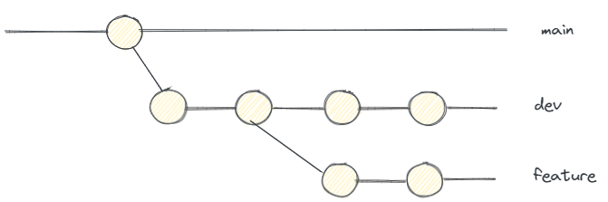
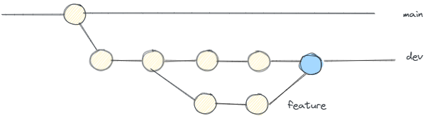
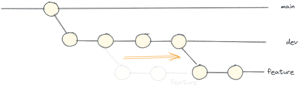
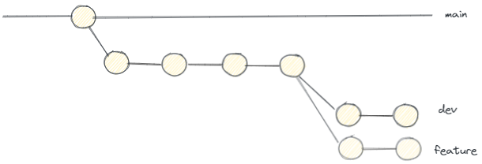

#### Branchig model

Git flow is a Git branching model that involves the use of multiple branches with very specific roles assigned. On the **Main** branch, each commit has a tag with a version number that represents an official release. The **Develop** branch works as an integration branch for new features; it's important to note that new features should never interact directly with **Main**. Whenever a new feature is to be created, a new **Feature** branch must be created from the **Develop** branch, and once it is finished it must be merged back to the **Develop** branch. When the **Develop** branch has enough features for a release, a **Release** branch must be created where changes related to bug fixes, documentation, and other release-oriented tasks should be committed. Once it's ready to ship, the **Release** branch gets merged into main and tagged with a version number. **HotFix** branches as the name suggests are forked from the **Main** branch to quickly patch production releases. As soon as the fix is complete, it should be merged into both **Main** and **Develop**.

#### Branch naming

A git branch name should start with a category (feature; bugfix; hotfix; release)

- **feature** (forked from **dev** → merged into **dev**)
- **bugfix** (forked from **dev** → merged into **dev**)
- **hotfix** (forked from **main** → merged into **main** and **dev**)
- **release** (forked from **dev** → merged into **main** and **dev**)
- **codequality** (forked from **dev** → merged into **dev**)
- **buildtools** (forked from **dev** → merged into **dev**)
- **automation** for automation tools???? (jenkins, gradle tasks, etc.)

and then followed by the issue and a short description as shown in the example below:

**feature/issue_12/popular_posts_listing**

#### Keeping the branch history clean 

Imagine the following scenario where the work from **feature** branch must be merged into **dev**.

If the merge from **feature** into **dev** is not fast-forward, which means that there are conflicts, a new merge commit will be created on the **dev** branch acting as a node to connect the two branches. Assuming that this can happen n times through the development, the **dev** branch history can become a little "messy". The next image shows a three-way merge from branch **feature** into branch **dev**. The merge commit is shown in blue.

Avoiding three-way merges can be done with the help of git rebase. When rebasing branch **dev** into **feature** means that we want to shift the begining of the **feature** branch to the tip of the **dev** branch. With this, we are rewriting the history of our **feature** branch. This must be only performed on a non-shared branch.
When doing this, we are forcing the fast-forward merge.

`git checkout feature`   
`git rebase dev`   
(solve the conflits)   
`git add .`   
`git rebase --continue`   

The last commands output a result, as shown in the next image.

After performing a `git merge feature` (assuming that the current checked out branch is **dev**), merging
**feature** into **dev** will result on a fast-forward merge as shown on the next figure.
 

SQUASHING COMMITS???

#### Commit description rules

(to be done)